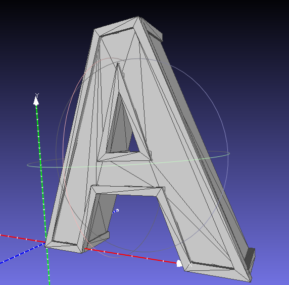

# Glift

## Description

Extract glyphs from ttf and create .obj

## Build

Tested on OSX, 10.11.6 at the oldest. Open Glift/Glift.sln in Visual Studio Community and hit Command + K to build.

## Usage

Hopefully the help description below will suffice. If it does not, then let me know.

```
usage: Glift.exe [OPTIONS]+ TTF

convert .ttf glyphs to .obj

positional arguments:
  TTF                        path to .ttf file

optional arguments:
  -c, --char=VALUE           specify a glyph by codepoint to convert to .obj. 
                               Exit 1 if VALUE is not a single character. If 
                               not specified, defaults to all glyphs in the tt-
                               f. This can stack
      --front-only           generate a .obj for the front face only
      --side-only            generate a .obj for the side face only
      --outline-only         generate a .obj for the outline face only
  -a, --angle=VALUE          angle (in degrees) restriction for generating 
                               side outlines where anything less than VALUE 
                               will have side outlines (prismoids) generated 
                               for that joint. In other words, if VALUE is 135, 
                               any joint along the front outline, whose angle 
                               is less than 135 degrees will have a side 
                               outline/prismoid generated at that joint. VALUE 
                               defaults to 135. Exit 1 if VALUE is not a valid 
                               double precision format
  -l, --list-names           list glyph names
  -p, --print                print .obj to console
  -d, --dry-run              do not write to .obj. Useful with -p if printing 
                               to console is the only requirement
  -s, --size=VALUE           size multiplier. The multiplicand is 72 points. 
                               The multiplier defaults to 1. Exit 1 if VALUE is 
                               not a valid floating point
  -x, --xoffset=VALUE        translate the model VALUE units across the x 
                               axis. Exit 1 if VALUE is not a valid floating 
                               point
  -y, --yoffset=VALUE        translate the model VALUE units across the y 
                               axis. Exit 1 if VALUE is not a valid floating 
                               point
  -z, --zdepth=VALUE         depth of the extrusion VALUE units across the z 
                               axis. Defaults to 15. Exit 1 if VALUE is a non-
                               integer
  -t, --thickness-outline=VALUE
                             thickness of outline in VALUE units. Defaults to 
                               10. Exit 1 if VALUE is not a valid floating point
      --experimental         enable experimental features
  -h, --help                 show this message and exit
```

## Example

```
$ cd path/to/Glift/Glift/bin/Debug
$ mono Glift.exe -c A ../../../GliftTest/Resources/Alef-Bold.ttf
```

an A.obj will be written to the current directory. Opening it up in meshlab looks something like...



## TODO

- also look into curve detection by processing the pre-flattened control points
- keep any eye for why scaling causes 72 to not be 72. It's speculated that Typography causes this when flattening points
- cmd line arg for reducing number of triangles in mesh
